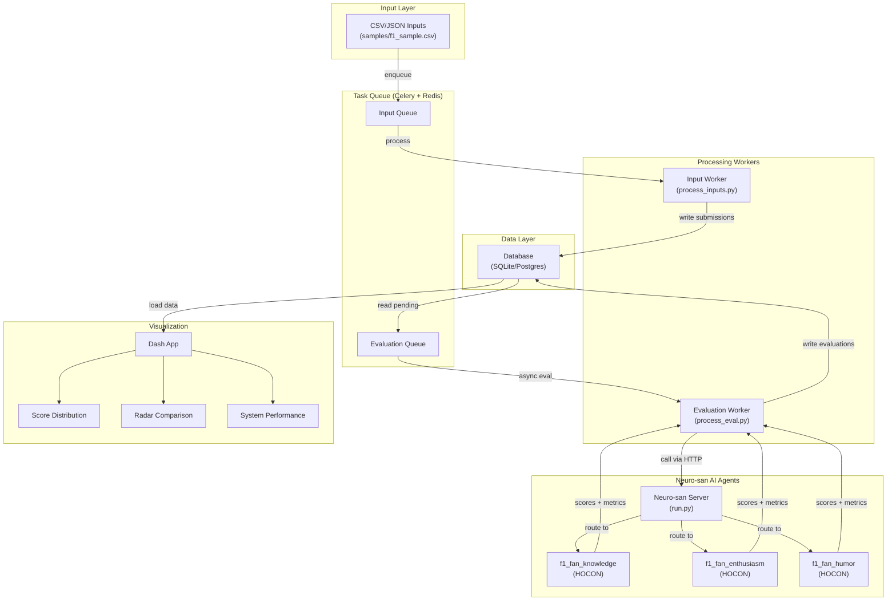

# 🏎️ f1-fans-eval

A scalable system to **ingest**, **evaluate**, and **visualize** F1 fan submissions using:

* **Neuro-san** Cognizant AI Lab's multi-agent AI accelerator framework for intelligent evaluation
* **Celery + Redis** for massively parallel processing
* **SQLAlchemy** (SQLite by default, easily swap to Postgres)
* **Dash (Plotly)** dashboards with a high-performance **EvalDataLoader**
* **uv** for fast, reproducible Python packaging

---

## ⚙️ Getting Started

### Clone this repo

```bash
git clone https://github.com/deepsaia/f1-fan-eval.git
```

Then

```bash
cd f1-fan-eval
```

### 1) Python & uv

```bash
# Install uv (if not already installed)
curl -LsSf https://astral.sh/uv/install.sh | sh

# Install dependencies
uv sync

# Optional: Install nsflow web UI
uv sync --group ui
```

This will create a virtual environment and install all dependencies automatically.

### 2) Redis (for Celery broker & backend)

* **macOS (Homebrew)**

  ```bash
  brew install redis
  brew services start redis
  ```
* **Ubuntu/Debian**

  ```bash
  sudo apt-get update && sudo apt-get install -y redis-server
  sudo systemctl enable --now redis-server
  ```
* **Docker (Optional)**

  ```bash
  docker run -p 6379:6379 redis:7
  ```

### 3) Database

* Default: SQLite file at `f1_fans_eval.db`
* Postgres (optional): set env vars in `.env` (see below)

---

## ✨ What it does

* **Input Processing**
  Reads CSV/JSON sources and writes normalized **Submissions** to DB.

* **AI Evaluation (Neuro-san)**
  Multi-agent evaluation system using specialized Neuro-san agents:
  - **f1_fan_knowledge**: Evaluates F1 technical knowledge across 10 criteria
  - **f1_fan_enthusiasm**: Measures fan passion and excitement
  - **f1_fan_humor**: Assesses entertainment value

  Each agent returns scores (1-100) + brief descriptions + token/cost metrics.

* **Dashboards (Dash)**
  Interactive dashboards (Raw Data, Score Distribution, Radar Comparison, System Performance), backed by a **singleton EvalDataLoader** that auto-infers schema and caches results.

---

## 🗂 Repo Layout

```
├── .env.example                    # Environment configuration template
├── coded_tools/                    # Custom tools for agents
├── dash_app/                       # Visualization dashboard (Plotly Dash)
│   ├── db/                         # Data loader
│   ├── pages/                      # Dashboard pages
│   └── utils/                      # Helper utilities
├── db/                             # Database layer (SQLAlchemy models)
├── deploy/                         # Celery workers & task enqueuers
├── eval/                           # Evaluation pipeline
├── input_processor/                # Input ingestion (CSV/JSON → DB)
├── pyproject.toml                  # uv packaging & dependencies
├── registries/                     # Neuro-san agent definitions (HOCON)
└── run.py                          # Neuro-san server runner
```

---

## 🧠 Architecture



### Key Components

1. **Neuro-san AI Agents** (`registries/*.hocon`): Multi-agent networks that evaluate submissions
   - `f1_fan_knowledge`: Evaluates F1 technical knowledge across 10 criteria
   - `f1_fan_enthusiasm`: Measures fan passion and excitement
   - `f1_fan_humor`: Assesses entertainment value

2. **Neuro-san Server** (`run.py`): Backend server that hosts and orchestrates AI agents

3. **Evaluation Pipeline** (`eval/process_eval.py`): Async orchestrator that sends submissions to agents

4. **Task Queue** (Celery + Redis): Enables parallel processing of inputs and evaluations

5. **Database** (SQLite/Postgres): Stores submissions and evaluation results

6. **Visualization** (Dash): Interactive dashboards for exploring results

---

## 🛠️ Customizing AI Agents

All evaluation agents are defined in `registries/*.hocon` files using Neuro-san's HOCON format.

### Agent Files

- **`manifest.hocon`**: Registry of available agents (which agents are served)
- **`f1_fan_knowledge.hocon`**: Knowledge evaluation agent (10 sub-criteria)
- **`f1_fan_enthusiasm.hocon`**: Enthusiasm evaluation agent
- **`f1_fan_humor.hocon`**: Humor evaluation agent
- **`aaosa.hocon`**: Shared configuration for all agents

### Editing Agents

Each agent HOCON file defines:
- **LLM configuration**: Model selection (e.g., `gpt-4o`, `claude-3-5-sonnet`)
- **Agent instructions**: System prompts and evaluation rubrics
- **Tools**: Functions the agent can call (e.g., `evaluate_score`, `manage_eval`)
- **Scoring criteria**: Sub-dimensions and their weights

**Example: Changing the evaluation rubric**

Edit `registries/f1_fan_knowledge.hocon`:

```hocon
"grounding_instructions": """
Follow this rubric when evaluating F1-related responses.

### RUBRIC
**1–30: Poor** – Lacks factual accuracy, generic
**31–50: Below Average** – Some relevant info, but superficial
**51–70: Good** – Solid understanding, accurate
**71–89: Strong** – Knowledgeable, insightful
**90–100: Exceptional** – Expert-level insight
"""
```

**Example: Changing the model**

```hocon
"llm_config": {
    "use_model": "claude-3-5-sonnet",  # or "gpt-4o", "gpt-4o-mini"
}
```

### Learn More

For detailed HOCON syntax and agent configuration options, see the [Neuro-san Agent HOCON Reference](https://github.com/cognizant-ai-lab/neuro-san/blob/main/docs/agent_hocon_reference.md).

---

## 🔐 Environment Configuration

For local development, copy `.env.example` to `.env` and customize as needed:

```bash
cp .env.example .env
```

**Important:** In production, use proper environment variables instead of `.env` files for better security and configuration management.

Key configuration sections:
- **Neuro-san Server**: Connection type, host, and port (HTTP: 8080)
- **Redis**: For Celery task queue
- **Database**: PostgreSQL (optional) or SQLite (default)
- **Processing**: Concurrency limits and timeouts
- **nsflow UI** (optional): Web interface settings

> If `POSTGRES_PASSWORD` is **empty**, the code falls back to SQLite: `sqlite:///f1_fans_eval.db`

---

## 🚀 Running the Neuro-San Server

The `run.py` script starts the Neuro-san AI agent server backend:

```bash
# Start server only (recommended for production)
python run.py

# Start server + nsflow web UI (if installed)
python run.py --with-ui

# Custom ports
python run.py --http-port 8080

# With UI on custom port
python run.py --with-ui --ui-port 4173
```

The server will be available at:
- **HTTP**: `localhost:8080`
- **nsflow UI** (if enabled): `http://localhost:4173`

---

## 🚚 Ingest (Inputs) — run locally or at scale

### 1) Enqueue input-processing tasks

```bash
python deploy/enqueue_input_tasks.py \
  --input-source samples/f1_sample.csv
```

### 2) Run Celery workers for inputs (parallel)

```bash
celery -A deploy.tasks_inputs worker --loglevel=INFO --concurrency=8
```

* Reads the input CSV/JSON
* Writes **Submissions** into DB

---

## 🧪 Evaluate — run locally or at scale

### 1) Enqueue evaluation tasks

```bash
python deploy/enqueue_eval_tasks.py
# optional filters:
#   --filter-source path/to/ids.csv|.json|.txt
#   --range 0-100
#   --sid <comma-separated-sub_ids>
#   --override        # re-evaluate even if present
#   --granular        # use per-score-type clients (still single 'description' input)
```

### 2) Run Celery workers for evaluations

```bash
celery -A deploy.tasks_eval worker --loglevel=INFO --concurrency=10
```

> Concurrency is up to you; bump based on CPU/IO and model server capacity.

---

## 🧭 Running processors without Celery (optional)

### Process inputs sequentially

```bash
python input_processor/process_inputs.py \
  --input-source samples/f1_sample.csv
```

### Evaluate from CLI (async per submission)

```bash
python -m eval.process_eval --override
# flags:
#   --db-url sqlite:///f1_fans_eval.db
#   --filter-source <csv/json/txt> or inline JSON list
#   --concurrency 8
#   --local-test
```

---

## 📊 Dash App (Dash + Plotly)

### Run the app

```bash
python dash_app/app.py
# Opens http://127.0.0.1:8050
```

### What’s inside

* **EvalDataLoader** (`dash_app/db/eval_data_loader.py`):
  Singleton, lru-cached loader. Infers columns from SQLAlchemy models and guarantees consistent DataFrames.
* **Reusable utils**

  * `utils/chart_helper.py` → histograms, boxplots, time-series, radar
  * `utils/layout_helper.py` → common layout scaffolding
  * `utils/data_helpers.py` → data cache & df builders
  * `utils/ui_helpers.py` → tables and small UI bits
* **Pages**

  * **Raw Data** (`pages/raw_data.py`)
  * **Score Distribution** (`pages/score_dist.py`)
  * **Radar Comparison** (`pages/radar_comp.py`)
  * **System Performance** (`pages/system_perf.py`)

> The app uses component-local `dcc.Store` caches and the shared **EvalDataLoader** for snappy UX even with large tables.

---

## 🧪 Example: End-to-End

```bash
# 1) Setup (first time only)
cp .env.example .env
uv sync

# 2) Start Redis
brew services start redis  # macOS
# OR: sudo systemctl start redis  # Linux

# 3) Start Neuro-san AI server (in terminal 1)
python run.py

# 4) Start Celery workers (in separate terminals)
# Terminal 2: Input processing worker
celery -A deploy.tasks_inputs worker --loglevel=INFO --concurrency=6

# Terminal 3: Evaluation worker
celery -A deploy.tasks_eval worker --loglevel=INFO --concurrency=10

# 5) Enqueue tasks (in another terminal)
python deploy/enqueue_input_tasks.py --input-source samples/f1_sample.csv
python deploy/enqueue_eval_tasks.py --override

# 6) Launch the Dash visualization app
python dash_app/app.py
```

---

## 🧰 Packaging & Dev

* Managed with **uv** via `pyproject.toml`
* Install dev dependencies:

  ```bash
  uv sync --group dev

  # Run code quality tools
  black .
  pylint f1-fans-eval
  pytest
  ```

* Install optional UI dependencies:

  ```bash
  uv sync --group ui
  ```

Key runtime deps:

* `celery`, `redis`, `sqlalchemy`, `pandas`, `dash`, `dash-bootstrap-components`, `neuro-san`

Optional UI deps:

* `nsflow`, `uvicorn`

---

## 📝 Notes & Tips

* **Neuro-san Agents**
  All evaluation logic is defined in `registries/*.hocon` files. You can customize rubrics, models, and scoring criteria without touching Python code. See [🛠️ Customizing AI Agents](#️-customizing-ai-agents) section above.

* **SQLite vs Postgres**
  SQLite is great for local/dev. For scale, set Postgres env vars in `.env`. The code auto-builds DB URLs.

* **Safety & Retries**
  Workers include retry policies. Evaluation calls use `MAX_RETRIES`, `RETRY_DELAY`, and a **semaphore** to protect AI servers from overload.

* **Multi-Agent Architecture**
  Each evaluation dimension (knowledge, enthusiasm, humor) has its own specialized Neuro-san agent. The `process_eval.py` orchestrator calls all three agents and aggregates their scores.

* **Dash Performance**
  DataTables use virtualization and `EvalDataLoader` caches to scale. No fixed row limits.

---
